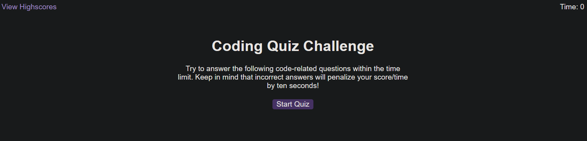

# Coding-Quiz

## Description 

An app that interacts with user to ask a set of coding questions. Immediate feedback is provided after each question is answered, with an accompanying sound. Scores are maintained in browser's local storage and can be shown as needed or indeed cleared at the press of a button. Additional questions can easily be added by expanding on the question in the questions.js file.

The URL for the application is: https://046159.github.io/Coding-Quiz/

Below is a screenshot of the completed application:

## Usage 

* Launch the website.
* Follow the on-screen prompts.

## Credits

The following websites provided valuable input into this challenge:

* https://www.w3schools.com

## License

Please refer to Github for the information on licensing.

## Tests

1. Confirm Start Quiz button starts the quiz.
2. When quiz is started, confirm:
    a. Count down timer is presented.
    b. Options are presented as buttons.
    c. Choosing an option provides visual and audio feedback.
    d. If question is answered incorrectly, 10 seconds is takenb off the timer.
3. When quiz is completed, the score is displayed and user is prompted for their initials.
4. Scores are stored to local storage and can be cleared with the button.
---
